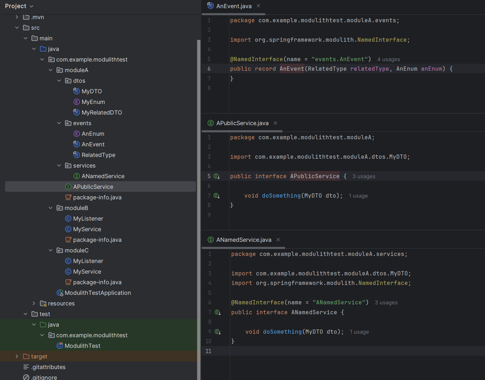
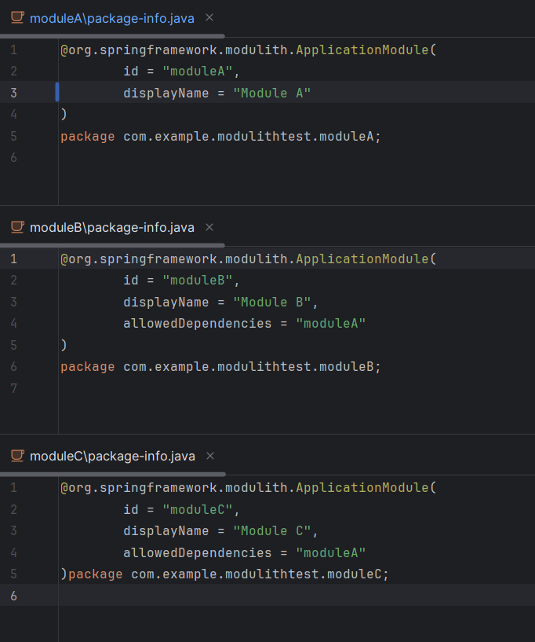

There are 3 modules in this project:
- Module A exposes:
  - One named Event
  - One named Service
  - One Root Package Service



- Modules B and C both depend on Module A:



But module setup can not be validated because there are related types that are not:

- explicitly annotated (MyEnum, MyRelatedDTO, AnEnum, RelatedType)
- present on the root package of the module

```log
org.springframework.modulith.core.Violations: 

- Module 'moduleB' depends on named interface(s) 'moduleA :: events.AnEvent' via com.example.modulithtest.moduleB.MyListener -> com.example.modulithtest.moduleA.events.AnEvent. Allowed targets: moduleA.
- Module 'moduleB' depends on module 'moduleA' via com.example.modulithtest.moduleB.MyService -> com.example.modulithtest.moduleA.dtos.MyEnum. Allowed targets: moduleA.
- Module 'moduleB' depends on module 'moduleA' via com.example.modulithtest.moduleB.MyService -> com.example.modulithtest.moduleA.dtos.MyRelatedDTO. Allowed targets: moduleA.
- Module 'moduleB' depends on module 'moduleA' via com.example.modulithtest.moduleB.MyService -> com.example.modulithtest.moduleA.dtos.MyDTO. Allowed targets: moduleA.

- Module 'moduleC' depends on named interface(s) 'moduleA :: events.AnEvent' via com.example.modulithtest.moduleC.MyListener -> com.example.modulithtest.moduleA.events.AnEvent. Allowed targets: moduleA.
- Module 'moduleC' depends on module 'moduleA' via com.example.modulithtest.moduleC.MyService -> com.example.modulithtest.moduleA.dtos.MyEnum. Allowed targets: moduleA.
- Module 'moduleC' depends on named interface(s) 'moduleA :: ANamedService' via com.example.modulithtest.moduleC.MyService -> com.example.modulithtest.moduleA.services.ANamedService. Allowed targets: moduleA.
- Module 'moduleC' depends on module 'moduleA' via com.example.modulithtest.moduleC.MyService -> com.example.modulithtest.moduleA.dtos.MyDTO. Allowed targets: moduleA.
- Module 'moduleC' depends on module 'moduleA' via com.example.modulithtest.moduleC.MyService -> com.example.modulithtest.moduleA.dtos.MyRelatedDTO. Allowed targets: moduleA.
```

Is this the intended behavior? Do we need to annotate every single related type or place them on the root folder?
